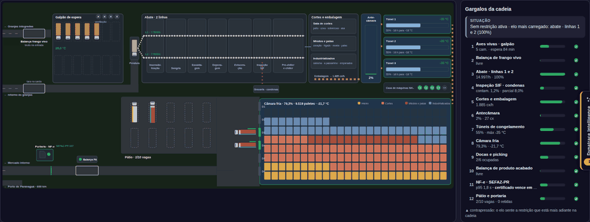
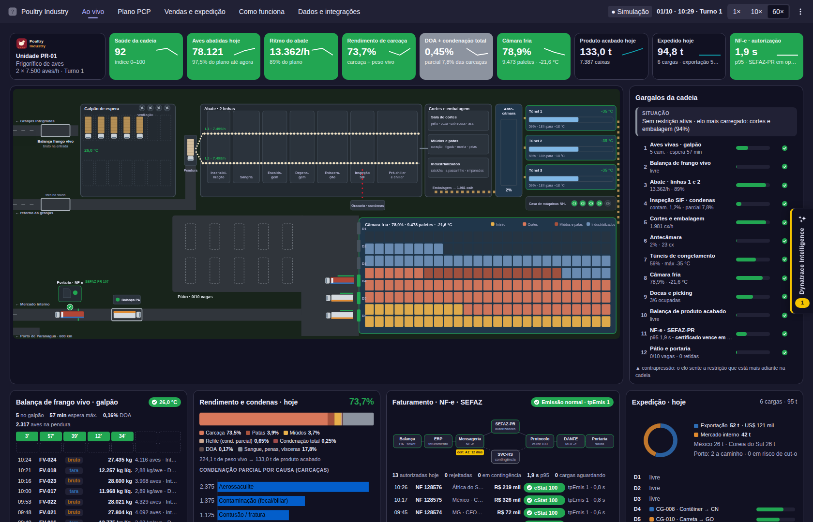
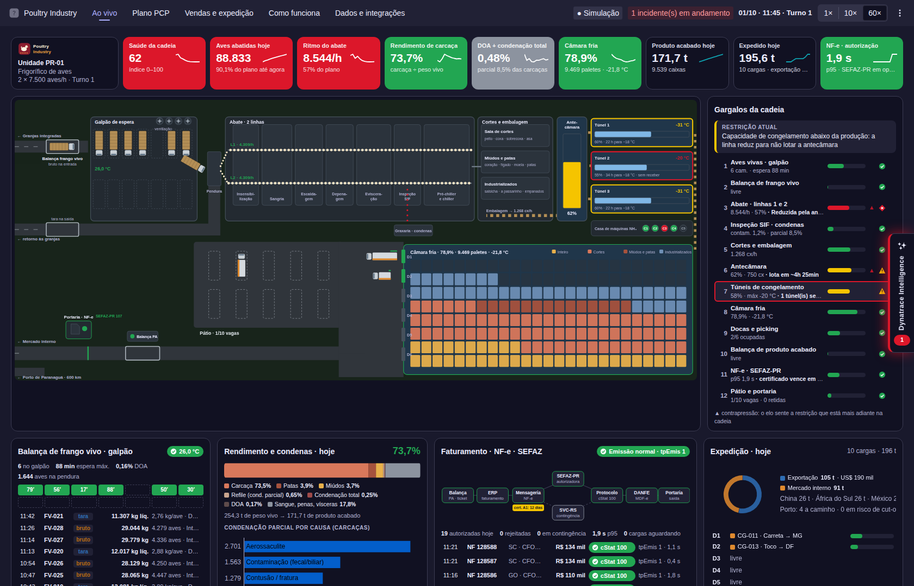
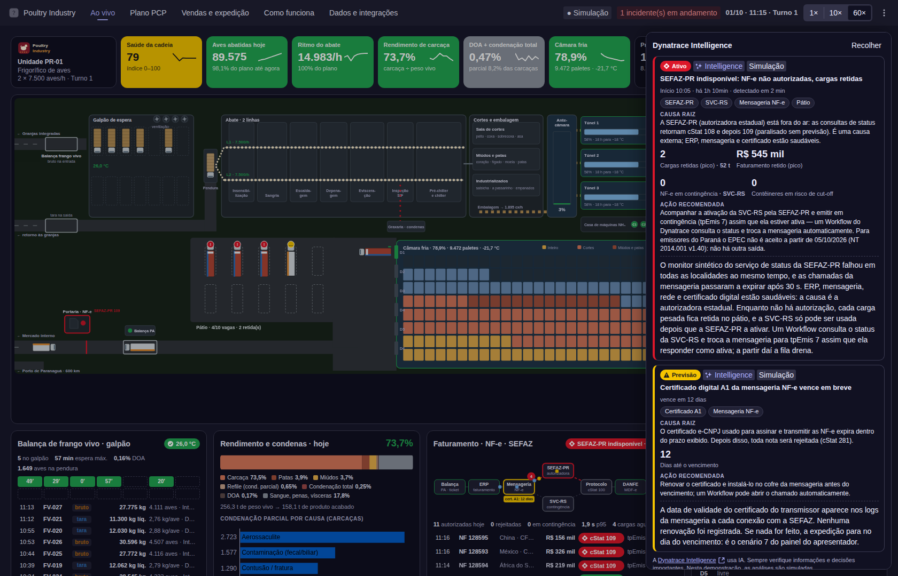
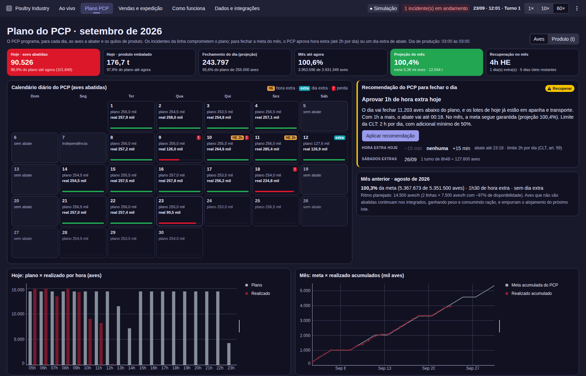
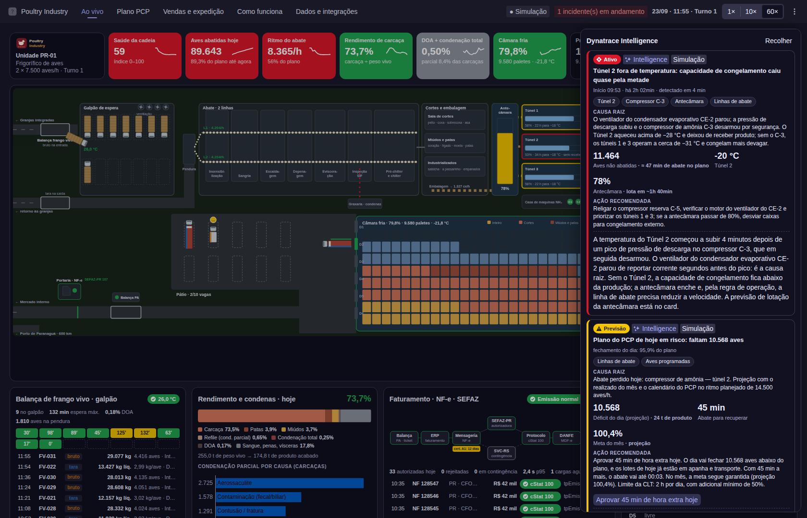
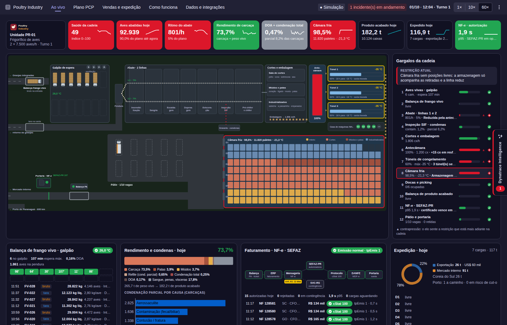
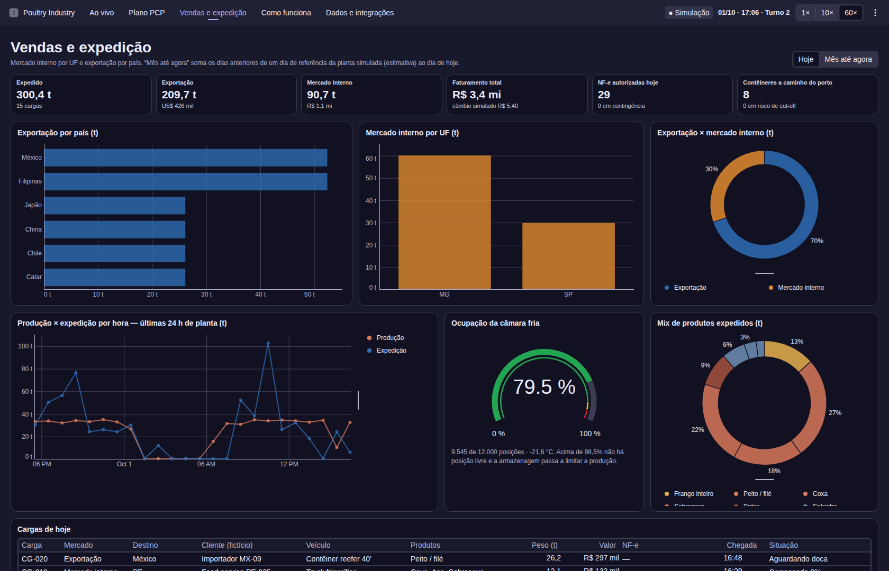
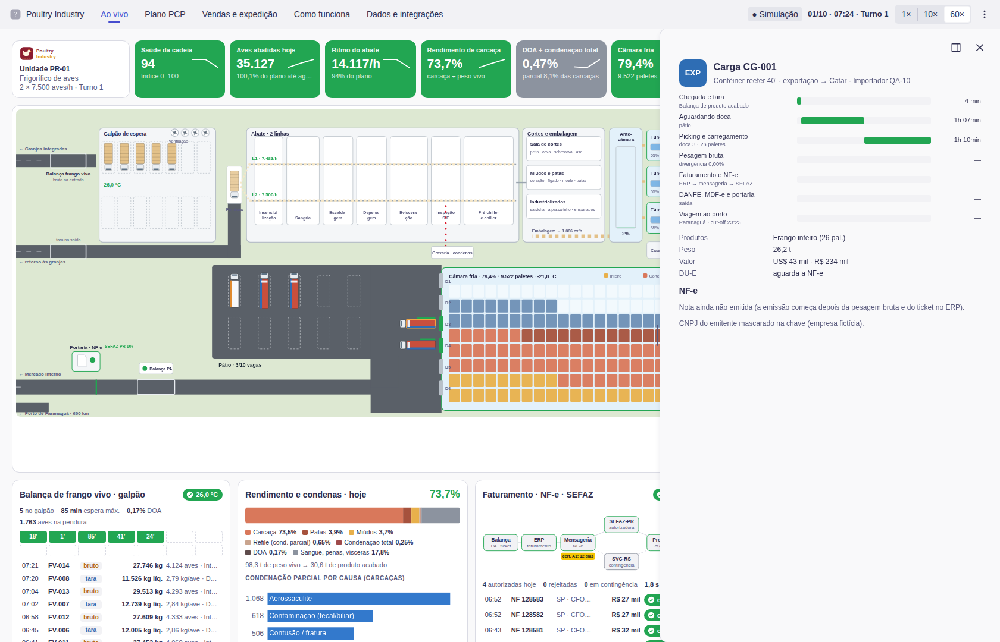

# Poultry Industry for Dynatrace

🌐 **Página do projeto:** https://adrianorafael.github.io/poultry-industry-for-dynatrace/

**Poultry Industry for Dynatrace** é um app criado e mantido por [@adrianorafael](https://github.com/adrianorafael) no GitHub.

Ele mostra, em movimento, a etapa final da **cadeia verticalizada do frango**: o caminhão de aves
vivas pesado na **balança de frango vivo**, a espera no galpão, as duas **linhas de abate**, o
**rendimento** e as **condenações**, os cortes e industrializados, os **túneis de congelamento**, a
**câmara fria**, as docas, a **balança de produto acabado**, a **NF-e autorizada pela SEFAZ** e a saída
para o **mercado interno** (por UF) ou para a **exportação** (por país, via porto de Paranaguá) — e
tudo isso contra o **plano do PCP**: o calendário diário de aves e de quilos, a meta do mês e a
**hora extra** ou o **dia extra** de abate quando um incidente tira a produção do plano. Por
cima disso, uma camada roteirizada de **Dynatrace Intelligence** detecta, explica e quantifica sete
gargalos que o apresentador dispara — e mostra como cada um **se propaga** pela cadeia. Foi feito para
demonstrações a clientes e roda sobre **dados simulados** de uma **empresa fictícia** ("Poultry Industry").

> **English summary.** A demo Dynatrace App (Portuguese UI) that animates a Brazilian poultry
> slaughterhouse chain — live-bird scale, slaughter lines, yield and condemnations, freezing tunnels,
> cold store, docks, finished-goods scale, NF-e (SEFAZ) and domestic/export shipping — measured against
> the production plan (PCP: daily birds and kg, monthly goal, overtime or Saturday shifts to recover) —
> with seven scripted bottleneck scenarios explained by a simulated Dynatrace Intelligence layer.
> Simulated data, fictitious company, no scopes, no DQL.

Este app **não está terminado** — é um **app de demonstração** que mostra como é simples construir o
seu próprio Dynatrace App com **vibecoding**, seguindo a documentação oficial em
[developer.dynatrace.com](https://developer.dynatrace.com/) e usando o **Strato Design System** da Dynatrace.

> ⚠️ **Aviso**
>
> Este app é disponibilizado pelo desenvolvedor **sem qualquer vínculo com a Dynatrace** e **sem responsabilidade** por falhas, problemas ou consumo de recursos e licenças. É uma **versão de estudo, sem suporte oficial**.
>
> Decidir baixá-lo e instalá-lo no seu ambiente é **por conta e risco do usuário**. Você também é livre para melhorar e ampliar suas funcionalidades.

**Versão atual:** `0.1.0` (ver [`app.config.json`](app.config.json) e [CHANGELOG.md](CHANGELOG.md)).



| Ao vivo, 10h | Compressor de amônia · Túnel 2 | SEFAZ-PR fora do ar · Dynatrace Intelligence |
| --- | --- | --- |
|  |  |  |
| **Plano PCP · calendário e recuperação** | **Túnel 2 · plano do dia em risco** | **Câmara fria lotada (navio omitiu escala)** |
|  |  |  |
| **Vendas e expedição · mês** | **Jornada da carga (tema claro)** | |
|  |  | |

*Screenshots com dados simulados de uma empresa fictícia.*

## Visão geral

Um simulador determinístico (`ui/app/sim/`) gera, no relógio da planta, caminhões de aves vivas,
pesagens, abate com microparadas, condenações por causa, rendimento, embalagem, congelamento com
tempo dependente da temperatura, ocupação da câmara fria, cargas com agendamento, pesagem, faturamento
e NF-e (cStat, tpEmis, protocolo), calibrado com números de referência do setor. O React atualiza os
painéis quatro vezes por segundo; a planta, as esteiras e as partículas da NF-e são animadas em SVG a
partir de um único loop de animação. **O app não lê nem grava nada no seu ambiente** — nenhuma DQL,
nenhuma app function, nenhum escopo OAuth — então instala em qualquer tenant e não gera consumo de
consultas no Grail. A aba *Dados e integrações* documenta exatamente quais eventos e métricas precisariam
ser conectados para rodar com dados reais.

A pesquisa (cadeia, números do setor, NF-e/SEFAZ, exportação, gargalos, fontes Dynatrace) e o
planejamento que deram origem ao app estão em **[`specs/poultry-industry.md`](specs/poultry-industry.md)**.

## Índice
1. [Pré-requisitos](#pré-requisitos)
2. [Instalar no seu ambiente (passo a passo)](#instalar-no-seu-ambiente-passo-a-passo)
3. [Instalação e configuração](#instalação-e-configuração)
4. [Modo de desenvolvimento](#modo-de-desenvolvimento)
5. [Publicar no ambiente (deploy)](#publicar-no-ambiente-deploy)
6. [Publicar em outro ambiente](#publicar-em-outro-ambiente)
7. [Escopos OAuth necessários](#escopos-oauth-necessários)
8. [Funcionalidades](#funcionalidades)
9. [Comportamentos importantes](#comportamentos-importantes)
10. [Custo de consultas e consumo (DPS)](#custo-de-consultas-e-consumo-dps)
11. [Solução de problemas](#solução-de-problemas)
12. [Estrutura de arquivos](#estrutura-de-arquivos)
13. [Scripts](#scripts)
14. [Versionamento e changelog](#versionamento-e-changelog)

## Pré-requisitos

- Node.js 24 (a versão suportada pelo `dt-app`; versões mais novas funcionam com um aviso)
- npm >= 9
- Um ambiente Dynatrace SaaS (plataforma de 3ª geração) onde você possa instalar apps
- Permissões IAM `app-engine:apps:install` e `app-engine:apps:run` (e `app-engine:apps:delete` para desinstalar)

```bash
npm install
```

## Instalar no seu ambiente (passo a passo)

1. **Confira suas permissões.** Seu usuário precisa de `app-engine:apps:install` e
   `app-engine:apps:run` no ambiente de destino (peça ao administrador Dynatrace, se necessário).
2. **Baixe o código.**
   ```bash
   git clone https://github.com/adrianorafael/poultry-industry-for-dynatrace.git
   cd poultry-industry-for-dynatrace
   npm install
   ```
3. **Aponte para o seu ambiente.** Em `app.config.json`, troque `YOUR-ENVIRONMENT` em
   `environmentUrl` pelo ID do seu tenant — copie da barra de endereços do navegador. O resultado tem a
   forma `https://YOUR-TENANT-ID.apps.dynatrace.com/`.
4. **(Opcional) Experimente antes** sem instalar: `npx dt-app dev` e abra o link que ele imprime.
5. **Instale:**
   ```bash
   npx dt-app deploy
   ```
   A primeira execução abre o navegador para o login na Dynatrace. O app não declara escopos OAuth,
   então não há tela de consentimento de acesso a dados.
6. **Abra:** na Dynatrace, vá em **Apps** (ou busque) → **Poultry Industry**.
7. **Apresente:** **P** abre o painel do apresentador, **1–7** disparam os cenários, **I** abre a
   Dynatrace Intelligence, **H** aprova a hora extra que o PCP recomenda — ou inicie o tour automático de
   6 minutos pelo painel do apresentador.
8. **Atualize depois:** incremente `app.version` em `app.config.json` e rode `npx dt-app deploy` de novo.
9. **Desinstale:** `npx dt-app uninstall` (precisa de `app-engine:apps:delete`).

## Instalação e configuração

### Passo 1 — Configure o ambiente de destino em `app.config.json`

```json
{
  "environmentUrl": "https://YOUR-ENVIRONMENT.apps.dynatrace.com/",
  "app": { "id": "my.poultry.industry" }
}
```

Troque `YOUR-ENVIRONMENT` pelo ID do seu tenant Dynatrace. A URL do ambiente tem a forma
`https://<tenant-id>.apps.dynatrace.com/` — copie da barra de endereços do seu ambiente.

**IMPORTANTE:** o ID do app precisa começar com `my.` para apps não assinados. IDs sem esse prefixo
exigem assinatura digital do app.

Arquivos que vêm com o marcador `YOUR-ENVIRONMENT`:

| Arquivo | O que trocar | Usado por |
| --- | --- | --- |
| `app.config.json` | `environmentUrl` | `dt-app dev` / `dt-app deploy` |
| `.vscode/launch.json` | a `url` de depuração | só para depurar na IDE |
| `.env.example` → copie para `.env` | `DT_ENVIRONMENT`, `DT_PLATFORM_TOKEN` | os servidores MCP opcionais em `.mcp.json` (nunca versionado) |

### Passo 2 — Autentique

O primeiro `npx dt-app dev` ou `npx dt-app deploy` abre o navegador para o login na Dynatrace.
Este app **não declara escopos OAuth**, então não há consentimento de acesso a dados.

## Modo de desenvolvimento

```bash
npx dt-app dev
```

**Abra o link impresso no terminal, não `localhost:3000` diretamente** — o app precisa rodar dentro do
contexto da Dynatrace. As mudanças recarregam sozinhas.

## Publicar no ambiente (deploy)

```bash
npx dt-app deploy
```

Compila e publica no ambiente de `app.config.json`. Depois disso o app fica disponível para todos os
usuários do tenant em **Dynatrace → Apps → Poultry Industry**. Cada novo deploy precisa de um novo
`app.version` em `app.config.json`.

## Publicar em outro ambiente

O deploy é por ambiente.

1. Edite `environmentUrl` em `app.config.json`
2. `npx dt-app deploy` (faça login no novo ambiente quando o navegador abrir)

**ATENÇÃO:**
- As preferências do apresentador (fontes, modo TV, ID do dashboard) ficam no `localStorage` de cada
  navegador; nada migra entre ambientes ou navegadores.
- O app não precisa de tabelas no Grail, então funciona igual em qualquer ambiente.
- Os usuários ainda precisam de `app-engine:apps:run` para abrir o app.

## Escopos OAuth necessários

| Escopo | Para quê |
| --- | --- |
| — | **Nenhum.** O app roda inteiro no navegador, com dados simulados. |

Adicionar um escopo depois do deploy obriga todo usuário a autorizar de novo no próximo acesso, e por
isso é uma mudança de versão MAJOR.

## Funcionalidades

### Ao vivo
- **Planta animada:** caminhões de aves vivas chegam das granjas, passam pela balança (bruto), aguardam
  no galpão de espera (com ventiladores e temperatura), descarregam na pendura e voltam para a tara; as
  duas linhas de abate mostram as aves passando por insensibilização, sangria, escaldagem, depenagem,
  evisceração, inspeção SIF e chiller; condenas caem na graxaria; caixas seguem para a antecâmara, os
  três túneis de congelamento (temperatura, ocupação e horas até −18 °C) e a câmara fria (paletes por
  família de produto); cargas agendadas aguardam no pátio, carregam nas seis docas, pesam na balança de
  produto acabado, esperam a NF-e (selo ⌛ / ! / ✓ sobre o caminhão) e saem pela portaria para o mercado
  interno ou para o porto de Paranaguá.
- **KPIs:** saúde da cadeia (0–100), aves abatidas hoje (com a aderência ao plano do PCP até agora), ritmo do abate, rendimento de carcaça, DOA +
  condenação total (métrica de perda, nunca verde), câmara fria, produto acabado, expedido e autorização
  da NF-e — com sparklines e limiares verde / amarelo / vermelho.
- **Gargalos da cadeia:** os 12 elos em ordem, com utilização, estado, a **restrição atual** e a
  **contrapressão** (▲) nos elos que já sentem a restrição que está mais adiante.
- **Balança de frango vivo e galpão:** pesagens recentes (bruto, tara, líquido, kg/ave, DOA) e as 14 baias
  coloridas pelo tempo de espera.
- **Rendimento e condenas:** balanço de massa do dia (carcaça, patas, miúdos, refile, condenação total,
  DOA, não comestíveis) e ranking das causas de condenação parcial.
- **Faturamento NF-e:** fluxo balança → ERP → mensageria → SEFAZ-PR / SVC-RS → protocolo → DANFE/MDF-e →
  portaria, uma partícula por nota; cStat, tpEmis, latência, validade do certificado A1 e fila.
- **Expedição:** exportação × mercado interno, principais países, docas com progresso do carregamento,
  pátio e contêineres a caminho do porto com risco de cut-off.
- **Jornadas:** clique em um caminhão ou em uma carga para ver a cascata estilo trace, da granja à tara
  ou da chegada à saída (e ao porto), com NF-e, chave de acesso (CNPJ mascarado) e protocolo.

### Plano PCP
- **Calendário do mês** com o plano diário do PCP em **aves** e em **produto (t)**, o realizado, a barra de
  aderência, feriados nacionais, horas extras (HE), dias extras e os dias com perda.
- **Hoje:** aves e produto contra o plano **até agora**, fechamento projetado do dia e plano × realizado
  por hora. **Mês:** aderência até agora, projeção do fechamento contra a meta e as curvas acumuladas.
- **Recomendação do PCP:** quando o dia ou o mês ficam para trás, quanto falta em aves e em horas de abate
  e o caminho — **hora extra** hoje ou nos próximos dias úteis (até 2 h por dia, CLT art. 59) ou
  **sábado extra** (um turno ≈ 127,6 mil aves). Aplicar a recomendação, ajustar a hora extra em passos de
  15 min ou programar sábados muda a planta: o turno 2 passa da meia-noite e o abate continua.
- Cada incidente que tira aves da linha mostra o custo em **horas de abate no plano**, e a Dynatrace
  Intelligence abre a previsão *Plano do PCP em risco* com o botão de aprovar a hora extra.
- Dia de produção de **03:00 às 03:00**. Os dias anteriores à sessão vêm de um histórico sintético e
  determinístico (perdas, horas extras e sábados extras); o mês anterior aparece fechado.

### Vendas e expedição
- Exportação por país, mercado interno por UF, exportação × mercado interno, mix de produtos expedidos,
  produção × expedição por hora (24 h), ocupação da câmara (gauge) e a tabela de cargas do dia.
- Visão **Hoje** ou **Mês até agora** (os dias anteriores do mês são estimados a partir de um dia de
  referência da planta simulada — e isso está dito na tela).

### Dynatrace Intelligence
- Aba recolhível na borda direita (tecla **I**) com contador de problemas ativos e previsões.
- Cards com causa raiz, entidades afetadas (clique para destacá-las na planta), impacto calculado pelo
  próprio modelo, tempo até a detecção, ação recomendada e uma explicação transmitida.
- Já na abertura: **previsão** de vencimento do certificado A1 da mensageria NF-e.
- Rotulado como *Simulação*, com o chip de IA do Strato e o aviso de uso de IA.

### Cenários do apresentador (um por elo da cadeia)
| Tecla | Cenário | O que acontece |
| --- | --- | --- |
| 1 | Calor no galpão de espera | Banco de ventiladores V-04 parado em dia de 34 °C: temperatura e DOA sobem |
| 2 | Contaminação na evisceração | Evisceradora L2 perde vácuo: contaminação ~7%, SIF reduz a L2, condenas ↑, rendimento ↓ |
| 3 | Compressor de amônia — Túnel 2 | C-3 desarma: T2 aquece e para de receber, T1/T3 congelam mais devagar, antecâmara enche, **linha reduz** |
| 4 | Navio omitiu escala | Começa no 4º dia sem retirada de contêineres: câmara a 98,5%, túneis travam, **linha reduz** |
| 5 | Balança de produto acabado sem integração | Tickets não chegam ao ERP; digitação manual após 30 min; pátio e docas lotam |
| 6 | SEFAZ-PR indisponível | cStat 108/109; cargas retidas até a SEFAZ-PR ativar a SVC-RS (~1h15); Workflow troca para tpEmis 7 |
| 7 | Certificado digital A1 vencido | Toda NF-e rejeitada (cStat 281) até instalar o certificado renovado |

- Painel do apresentador (**P**): cenários, velocidade 1× / 10× / 60×, hora simulada, semente, reinício
  do dia, aprovação da hora extra / sábado extra do PCP (**H**), link opcional para um dashboard e tour
  automático de 6 minutos.
- **Fontes Dynatrace** (**D**): de onde viria cada painel na vida real. Resumo (**R**), modo TV (**T**),
  pausa (**Espaço**).

### Abas de documentação
- **Como funciona:** a cadeia elo por elo, gargalos e contrapressão, o que é simulado e o que muda com
  dados reais.
- **Dados e integrações:** o caminho dos dados do chão de fábrica à Dynatrace, os Business Events
  `poultry.*` e seus campos (incluindo o calendário do PCP e a aprovação de hora extra), as métricas OT,
  o Business Flow, os Workflows e a ordem de implantação.

## Comportamentos importantes

### Tudo é simulado
Nenhum dado sai ou entra no tenant. A empresa, os integrados, os clientes, os veículos, as notas e os
incidentes são fictícios; países, estados, portos e órgãos públicos (SEFAZ-PR, SVC-RS, SIF, MAPA) são
reais porque fazem parte do domínio. Os textos da Dynatrace Intelligence são roteirizados; os números de
impacto saem do modelo.

### O plano do PCP e o dia de produção
O dia de produção vai das **03:00 às 03:00**: "hoje" no app (aves, produto, NF-e, cargas) e o realizado
do PCP usam esse dia, para que a hora extra depois da meia-noite e as caixas embaladas até ~02:50 fiquem
no dia em que o abate começou. Só os dias úteis (segunda a sexta, sem feriados nacionais) têm plano; a
planta simulada, porém, abate todos os dias — num sábado, domingo ou feriado o calendário mostra o dia
como **abate extra**, e o mês fica à frente da meta. Os dias anteriores à abertura do app são um histórico
sintético, o mesmo para a mesma semente.

### Relógio da planta
A planta segue o fuso horário de quem abre o app, com turnos 05:00–13:48 e 14:30–23:18 e higienização à
noite. A velocidade padrão é **60×** (1 minuto real = 1 hora de planta). À noite as linhas estão paradas:
use a hora simulada do painel do apresentador.

### Os incidentes correm no tempo da planta
Não há números roteirizados de impacto: a propagação (antecâmara, túneis, linha, pátio, docas) sai do
próprio modelo. Um incidente de 3 horas dura 3 minutos a 60×.

### Mudar a hora reconstrói a planta
Ao abrir o app, ao mudar a hora simulada e depois de a aba ficar oculta, o simulador recalcula as
últimas horas da planta em passos rápidos. Mudar a hora encerra os incidentes ativos.

### Determinístico pela semente
A mesma semente, na mesma hora simulada, reproduz exatamente os mesmos caminhões e cargas.

### Preferências por navegador
Fontes Dynatrace, modo TV e o ID do dashboard ficam no `localStorage`.

## Custo de consultas e consumo (DPS)

> ⚠️ **Leia antes de rodar o app em um ambiente de produção.** Apps que executam DQL ao vivo contra o
> Grail consomem o orçamento do Dynatrace Platform Subscription (DPS). Entenda e meça para evitar
> surpresas na fatura.

### O que gera custo nesta versão

**Nada.** A versão `0.1.0` não executa **nenhuma consulta DQL e nenhuma app function**; todos os dados
são gerados no navegador. Não há consumo de **"Grail Query – data analyzed"**.

| Fator | Efeito no custo | Esta versão |
| --- | --- | --- |
| **Auto-refresh / polling** | 🔴 Dominante em apps com dados — 1 consulta por intervalo, por aba aberta | Não se aplica (sem consultas) |
| **Largura do intervalo de tempo** | Janela maior = mais dados varridos | Não se aplica |
| **Usuários / abas simultâneas** | Multiplica linearmente | Sem efeito |
| **Volume de dados** | Mais registros = mais GB varridos | Sem efeito |

### Se você criar um modo com dados reais (roadmap, não publicado)

Uma planta ao vivo com dados reais consultaria Business Events com frequência — e o polling é
exatamente o fator dominante acima. Nenhuma consulta desse tipo é publicada nesta versão, então não há
número medido para divulgar: meça o `scannedBytes` da sua consulta antes de ligá-la:

```
GB/mês ≈ GB_por_consulta × consultas_por_hora × horas_por_dia × dias × abas_simultâneas
custo  ≈ GB/mês × a sua tarifa DPS "Grail Query – data analyzed"
```

| Cenário | Consultas/mês | GB varridos | Custo estimado* |
| --- | --- | --- | --- |
| Versão 0.1.0 (simulador), qualquer uso | 0 | 0 | Nenhum |

\* Para um futuro modo com dados reais, multiplique os GB medidos pela tarifa *"Grail Query – data
analyzed"* do seu contrato — o valor depende inteiramente da sua tabela de preços.

### Como medir com precisão (recomendado)

1. Cole a consulta em um **Notebook** e veja os metadados de varredura. Programaticamente,
   `queryExecute(...)` retorna `metadata.grail.scannedBytes` e `scannedRecords` — o custo real por execução.
2. **Account Management → Cost & usage → Grail Query** confirma o consumo agregado depois de rodar
   cenários com e sem o app.

### Como reduzir (para um futuro modo com dados reais)

- Consulte no maior intervalo que a demonstração tolera e pause quando a aba estiver oculta.
- Mantenha a janela curta (minutos, não horas) e leia só os registros novos desde a última consulta.
- Projete só os campos necessários com `| fields …` — o Grail é colunar.
- Pré-agregue KPIs (métricas ou `makeTimeseries`) em vez de reler eventos brutos.

## Solução de problemas

| Sintoma | Causa e correção |
| --- | --- |
| Erro de validação: `'app.description' must NOT have more than 80 characters` | Encurte a descrição. |
| O deploy falha porque a versão já existe | Incremente `app.version` em `app.config.json` (e CHANGELOG, README, página). |
| O app abre em `localhost:3000` mas parece quebrado | Abra o link impresso pelo `npx dt-app dev` — o app precisa rodar dentro da Dynatrace. |
| As linhas estão paradas e quase nada se mexe | É noite no seu fuso (higienização): escolha 10:00 ou 17:00 na hora simulada do painel do apresentador. |
| Nada se mexe | A simulação está pausada (Espaço) ou a velocidade está em 1×; use 60×. |
| O Plano PCP não recomenda nada depois de um incidente | O mês já estava à frente da meta e o dia ainda fecha dentro da tolerância (15 min de abate). Deixe o incidente correr mais ou dispare o 3 (túnel) por ~1 h de planta. |
| A hora extra não pode ser aprovada | O abate do dia já terminou (higienização): a hora extra só estende o turno que ainda está rodando. |
| O cenário da SEFAZ não retém nenhuma carga | Não havia carga sendo faturada naquele momento: dispare-o às 10:00 ou 17:00, quando as cargas do pico chegam à balança. |
| As animações pesam em um notebook lento | Use 10×, evite combinar cenários ou ative "reduzir movimento" no sistema (o app desliga as partículas e o fluxo das esteiras). |
| Botão "Abrir dashboard" não aparece | Cole o ID de um documento de dashboard no painel do apresentador; o botão só aparece quando preenchido. |
| Aviso sobre a versão do Node.js | O `dt-app` suporta Node 24; versões mais novas funcionam, mas mostram um aviso. |

## Estrutura de arquivos

- **`app.config.json`** — URL do ambiente (marcador), id do app, versão, ícone, escopos (nenhum).
- **`specs/poultry-industry.md`** — a pesquisa e o planejamento (fontes, números, cenários, calibração).
- **`ui/app/sim/`** — o simulador: `engine.ts` (planta, plano do PCP, cenários, KPIs, Intelligence), `model.ts`
  (números da planta, plano e feriados, produtos, países, UFs, preços), `scenarios.ts` (os sete cenários e seus textos), `types.ts`,
  `time.ts`, `rng.ts` e `__tests__/calibration.test.ts`.
- **`ui/app/scene/`** — a planta animada (`PlantScene.tsx`, `trucks.ts`, `geometry.ts`).
- **`ui/app/components/`** — KPIs, gargalos, balança e galpão, rendimento, NF-e, expedição, Dynatrace
  Intelligence, detalhes, apresentador e resumo.
- **`ui/app/pages/`** — `Live.tsx`, `Plan.tsx` (plano do PCP), `Sales.tsx`, `HowItWorks.tsx`, `DataIntegrations.tsx`.
- **`ui/app/data/`** — descrição de cada elo (`stages.ts`) e o mapa de dados reais (`integration-map.ts`).
- **`ui/app/theme/colors.ts`** — paleta de status, marca, famílias de produto e planta (fonte única de cor).
- **`ui/assets/`** — logos e ícone da marca fictícia.
- **`docs/`** — a página do projeto (GitHub Pages), com `docs/img/` para os screenshots e a prévia animada.
- **`scripts/`** — `scan-secrets.sh`, hook `pre-commit` opcional, `test-sim.mjs`.

## Scripts

| Script | Executa | Descrição |
| --- | --- | --- |
| `npm run start` | `dt-app dev` | Desenvolvimento com recarga automática |
| `npm run build` | `dt-app build` | Build de produção |
| `npm run deploy` | `dt-app deploy` | Build e deploy no ambiente configurado |
| `npm run uninstall` | `dt-app uninstall` | Remove o app do ambiente |
| `npm run update` | `dt-app update` | Atualiza os pacotes `@dynatrace` e aplica migrações |
| `npm run lint` | `eslint .` | Lint, incluindo regras de segurança e de segredos |
| `npm run typecheck` | `tsc --noEmit` | Verificação de tipos |
| `npm run test:sim` | `scripts/test-sim.mjs` | Testes de calibração do simulador |
| `npm run scan:secrets` | `scripts/scan-secrets.sh` | Varredura de segredos e dados de tenant |

Opcional: instale a varredura de segredos no pre-commit com `cp scripts/pre-commit .git/hooks/pre-commit`.

## Versionamento e changelog

Este app segue o [Semantic Versioning](https://semver.org/), em que "quebra" significa quebrar **para
quem executa o app**:

| Incremento | Quando |
| --- | --- |
| **MAJOR** | Um escopo mudou (todos consentem de novo) · formato de estado persistido mudou sem migração · uma funcionalidade foi removida · um padrão mudou de um jeito que aumenta custo |
| **MINOR** | Nova visão, gráfico, filtro ou configuração — nada existente quebra |
| **PATCH** | Correção, texto, estilo, atualização de dependência, consulta otimizada com resultado idêntico |

- `app.config.json` → `app.version` é a fonte única da verdade.
- Toda versão é registrada no [CHANGELOG.md](CHANGELOG.md).
- A mesma versão nunca é publicada duas vezes.

Para saber mais sobre a plataforma Dynatrace, veja o
[Dynatrace Developer](https://developer.dynatrace.com/).

---

Construído seguindo o [Development Pattern for Dynatrace](https://github.com/adrianorafael/development-pattern-for-Dynatrace).
Licenciado sob a [MIT License](LICENSE).
